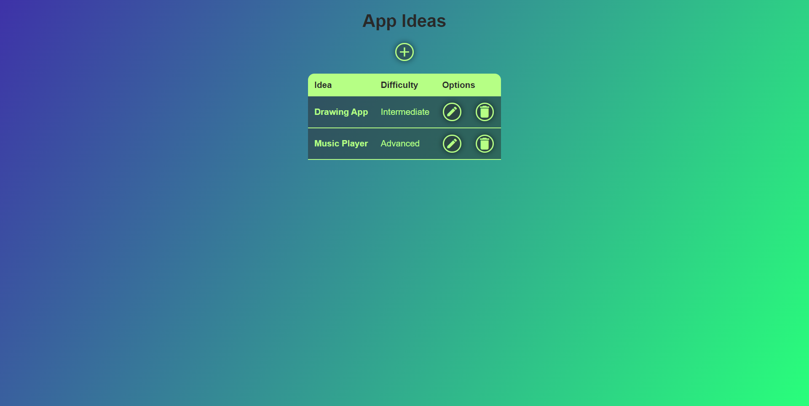

# App Idea CRUD

Made with Node JS and MongoDB.

## Instructions
Use these commands to install the necessary dependencies:
```
npm i mongoose
npm i express
npm i ejs
npm install -g nodemon
```
Use the next command on root project's directory to start the server:
```
nodemon server.js
```

Go to localhost:3000 on browser and enjoy!

## Features
- Put your app idea and save it on this web application.
- Data displaying on a table.
- Elegant UI.
- Simple and fast usage.

## Screenshots


